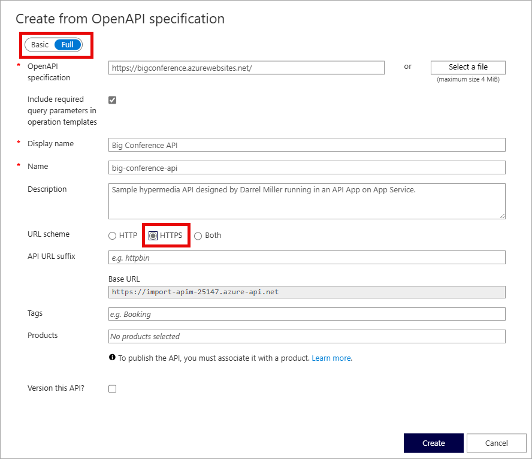

---
lab:
    topic: Azure API Management
    title: 'Import and configure an API with Azure API Management'
    description: 'Learn how to import, publish, and test an API that conforms to the OpenAPI specification.'
---

# Import and configure an API with Azure API Management

In this exercise, you create an Azure API Management instance, import an OpenAPI specification backend API, configure the API settings including the web service URL and subscription requirements, and test the API operations to verify they work correctly.

Tasks performed in this exercise:

* Create an Azure API Management (APIM) instance
* Import an API
* Configure the backend settings
* Test the API

This exercise takes approximately **20** minutes to complete.

## Before you start

To complete the exercise, you need:

* An Azure subscription. If you don't already have one, you can [sign up for one](https://azure.microsoft.com/).

## Create an API Management instance

In this section of the exercise you create a resource group and Azure Storage account. You also record the endpoint, and access key for the account.

1. In your browser navigate to the Azure portal [https://portal.azure.com](https://portal.azure.com); signing in with your Azure credentials if prompted.

1. Use the **[\>_]** button to the right of the search bar at the top of the page to create a new cloud shell in the Azure portal, selecting a ***Bash*** environment. The cloud shell provides a command line interface in a pane at the bottom of the Azure portal.

    > **Note**: If you have previously created a cloud shell that uses a *PowerShell* environment, switch it to ***Bash***.

1. Create a resource group for the resources needed for this exercise. Replace **myResourceGroup** with a name you want to use for the resource group. You can replace **eastus2** with a region near you if needed. If you already have a resource group you want to use, proceed to the next step.

    ```azurecli
    az group create --location eastus2 --name myResourceGroup
    ```

1. Create a few variables for the CLI commands to use, it reduces amount of typing. Replace **myLocation** with the value you chose earlier. The APIM name needs to be a globally unique name, and the following script generates a random string. Replace **myEmail** with an email address you can access.

    ```bash
    myApiName=import-apim-$RANDOM
    myLocation=myLocation
    myEmail=myEmail
    ```

1. Create an APIM instance. The **az apim create** command is used to create the instance. Replace **myResourceGroup** with the value you chose earlier.

    ```bash
    az apim create -n $myApiName \
        --location $myLocation \
        --publisher-email $myEmail  \
        --resource-group myResourceGroup \
        --publisher-name Import-API-Exercise \
        --sku-name Consumption 
    ```
    > **Note:** The operation should complete in about five minutes. 

## Import a backend API

This section shows how to import and publish an OpenAPI specification backend API.

1. In the Azure portal, search for and select **API Management services**.

1. On the **API Management services** screen, select the API Management instance you created.

1. In the **API management service** navigation pane, select  **> APIs** and then select **APIs**.

    


1. Select **OpenAPI** in the **Create from definition** section, and set the **Basic/Full** toggle to **Full** in the pop-up that appears.

    

    Use the values from the following table to fill out the form. You can leave any fields not mentioned to their default value.

    | Setting | Value | Description |
    |--|--|--|
    | **OpenAPI Specification** | `https://bigconference.azurewebsites.net/` | References the service implementing the API, requests are forwarded to this address. Most of the necessary information in the form is automatically populated after you enter this value. |
    | **URL scheme** | Select **HTTPS**. | Defines the security level of the HTTP protocol accepted by the API. |

1. Select **Create**.

## Configure the API settings

The *Big Conference API* is created. Now it's time to configure the API settings. 

1. Select **Settings** in menu.

1. Enter `https://bigconference.azurewebsites.net/` in the **Web service URL** field.

1. Deselect the **Subscription required** checkbox.

1. Select **Save**.

## Test the API

Now that the API has been imported and configured it's time to test the API.

1. Select **Test** in the menu bar. This will display all of the operations available in the API.

1. Search for, and select the **Speakers_Get** operation. 

1. Select **Send**. You may need to scroll down on the page to view the HTTP response.

    Backend responds with **200 OK** and some data.

## Clean up resources

Now that you finished the exercise, you should delete the cloud resources you created to avoid unnecessary resource usage.

1. Navigate to the resource group you created and view the contents of the resources used in this exercise.
1. On the toolbar, select **Delete resource group**.
1. Enter the resource group name and confirm that you want to delete it.

> **CAUTION:** Deleting a resource group deletes all resources contained within it. If you chose an existing resource group for this exercise, any existing resources outside the scope of this exercise will also be deleted.
