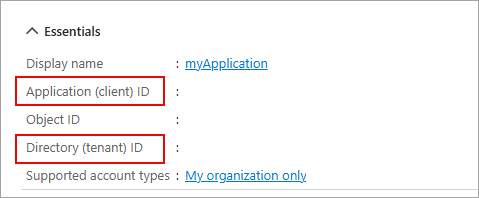
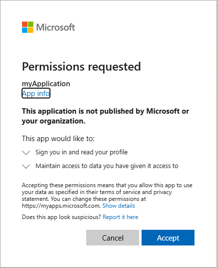

---
lab:
    topic: Azure authentication and authorization
    title: "Retrieve user profile information with the Microsoft Graph SDK"
    description: "Learn how to retrieve user profile information from Microsoft Graph."
---

# Retrieve user profile information with the Microsoft Graph SDK

In this exercise, you create a .NET app to authenticate with Microsoft Entra ID and request an access token, then call the Microsoft Graph API to retrieve and display your user profile information. You learn how to configure permissions and interact with Microsoft Graph from your application.

Tasks performed in this exercise:

* Register an application with the Microsoft identity platform
* Create a .NET console application that implements interactive authentication, and uses the **GraphServiceClient** class to retrieve user profile information.

This exercise takes approximately **15** minutes to complete.

## Before you start

To complete the exercise, you need:

* An Azure subscription. If you don't already have one, you can [sign up for one](https://azure.microsoft.com/).

* [Visual Studio Code](https://code.visualstudio.com/) on one of the [supported platforms](https://code.visualstudio.com/docs/supporting/requirements#_platforms).

* [.NET 8](https://dotnet.microsoft.com/en-us/download/dotnet/8.0) or greater.

* [C# Dev Kit](https://marketplace.visualstudio.com/items?itemName=ms-dotnettools.csdevkit) for Visual Studio Code.

## Register a new application

1. In your browser navigate to the Azure portal [https://portal.azure.com](https://portal.azure.com); signing in with your Azure credentials if prompted.

1. Use the **[\>_]** button to the right of the search bar at the top of the page to create a new cloud shell in the Azure portal, selecting a ***Bash*** environment. The cloud shell provides a command line interface in a pane at the bottom of the Azure portal.

    > **Note**: If you have previously created a cloud shell that uses a *PowerShell* environment, switch it to ***Bash***.

1. In the cloud shell toolbar, in the **Settings** menu, select **Go to Classic version** (this is required to use the code editor).

1. In the portal, search for and select **App registrations**. 

1. Select **+ New registration**, and when the **Register an application** page appears, enter your application's registration information:

    | Field | Value |
    |--|--|
    | **Name** | Enter `myGraphApplication`  |
    | **Supported account types** | Select **Accounts in this organizational directory only** |
    | **Redirect URI (optional)** | Select **Public client/native (mobile & desktop)** and enter `http://localhost` in the box to the right. |

1. Select **Register**. Microsoft Entra ID assigns a unique application (client) ID to your app, and you're taken to your application's **Overview** page. 

1. In the **Essentials** section of the **Overview** page record the **Application (client) ID** and the **Directory (tenant) ID**. The information is needed for the application.

    
 
## Create a .NET console app to send and receive messages

Now that the needed resources are deployed to Azure the next step is to set up the console application. TThe following steps are performed in your local environment.

1. Create a folder named **graphapp**, or a name of your choosing, for the project.

1. Launch **Visual Studio Code** and select **File > Open folder...** and select the project folder.

1. Select **View > Terminal** to open a terminal.

1. Run the following command in the VS Code terminal to create the .NET console application.

1. Create the .NET console application.

    ```
    dotnet new console
    ```

1. Run the following commands to add the **Azure.Identity**,  **Microsoft.Graph**, and the **dotenv.net** packages to the project.

    ```
    dotnet add package Azure.Identity
    dotnet add package Microsoft.Graph
    dotnet add package dotenv.net
    ```

### Configure the console application

In this section you create, and edit, a **.env** file to hold the secrets you recorded earlier. 

1. Select **File > New file...** and create a file named *.env* in the project folder.

1. Open the **.env** file and add the following code. Replace **YOUR_CLIENT_ID**, and **YOUR_TENANT_ID** with the values you recorded earlier.

    ```
    CLIENT_ID="YOUR_CLIENT_ID"
    TENANT_ID="YOUR_TENANT_ID"
    ```

1. Press **ctrl+s** to save the file.

### Add the starter code for the project

1. Open the *Program.cs* file and replace any existing contents with the following code. Be sure to review the comments in the code.

    ```csharp
    using Microsoft.Graph;
    using Azure.Identity;
    using dotenv.net;
    
    // Load environment variables from .env file (if present)
    DotEnv.Load();
    var envVars = DotEnv.Read();
    
    // Read Azure AD app registration values from environment
    string clientId = envVars["CLIENT_ID"];
    string tenantId = envVars["TENANT_ID"];
    
    // Validate that required environment variables are set
    if (string.IsNullOrEmpty(clientId) || string.IsNullOrEmpty(tenantId))
    {
        Console.WriteLine("Please set CLIENT_ID and TENANT_ID environment variables.");
        return;
    }
    
    // ADD CODE TO DEFINE SCOPE AND CONFIGURE AUTHENTICATION
    
    
    
    // ADD CODE TO CREATE GRAPH CLIENT AND RETRIEVE USER PROFILE
    
    
    ```

1. Press **ctrl+s** to save your changes.

### Add code to complete the application

1. Locate the **// ADD CODE TO DEFINE SCOPE AND CONFIGURE AUTHENTICATION** comment and add the following code directly after the comment. Be sure to review the comments in the code.

    ```csharp
    // Define the Microsoft Graph permission scopes required by this app
    var scopes = new[] { "User.Read" };
    
    // Configure interactive browser authentication for the user
    var options = new InteractiveBrowserCredentialOptions
    {
        ClientId = clientId, // Azure AD app client ID
        TenantId = tenantId, // Azure AD tenant ID
        RedirectUri = new Uri("http://localhost") // Redirect URI for auth flow
    };
    var credential = new InteractiveBrowserCredential(options);
    ```

1. Locate the **// ADD CODE TO CREATE GRAPH CLIENT AND RETRIEVE USER PROFILE** comment and add the following code directly after the comment. Be sure to review the comments in the code.

    ```csharp
    // Create a Microsoft Graph client using the credential
    var graphClient = new GraphServiceClient(credential);
    
    // Retrieve and display the user's profile information
    Console.WriteLine("Retrieving user profile...");
    await GetUserProfile(graphClient);
    
    // Function to get and print the signed-in user's profile
    async Task GetUserProfile(GraphServiceClient graphClient)
    {
        try
        {
            // Call Microsoft Graph /me endpoint to get user info
            var me = await graphClient.Me.GetAsync();
            Console.WriteLine($"Display Name: {me?.DisplayName}");
            Console.WriteLine($"Principal Name: {me?.UserPrincipalName}");
            Console.WriteLine($"User Id: {me?.Id}");
        }
        catch (Exception ex)
        {
            // Print any errors encountered during the call
            Console.WriteLine($"Error retrieving profile: {ex.Message}");
        }
    }
    ```

1. Press **ctrl+s** to save the file.

## Run the application

Now that the app is complete it's time to run it. 

1. Start the application by running the following command:

    ```
    dotnet run
    ```

1. The app opens the default browser prompting you to select the account you want to authenticate with. If there are multiple accounts listed select the one associated with the tenant used in the app.

1. If this is the first time you've authenticated to the registered app you receive a **Permissions requested** notification asking you to approve the app to sign you in and read your profile, and maintain access to data you have given it access to. Select **Accept**.

    

1. You should see the results similar to the example below in the console.

    ```
    Retrieving user profile...
    Display Name: <Your account display name>
    Principal Name: <Your principal name>
    User Id: 9f5...
    ```

1. Start the application a second time and notice you no longer receive the **Permissions requested** notification. The permission you granted earlier was cached.

## Clean up resources

Now that you finished the exercise, you should delete the app registration you created earlier.

1. In the Azure portal, navigate to the app registration you created.
1. On the toolbar, select **Delete**.
1. Confirm the deletion.
